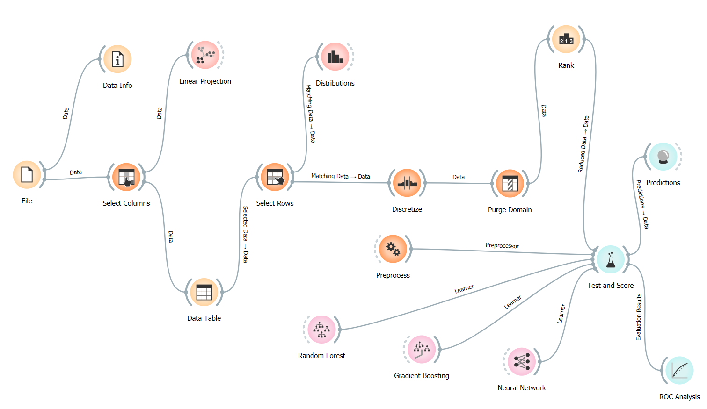
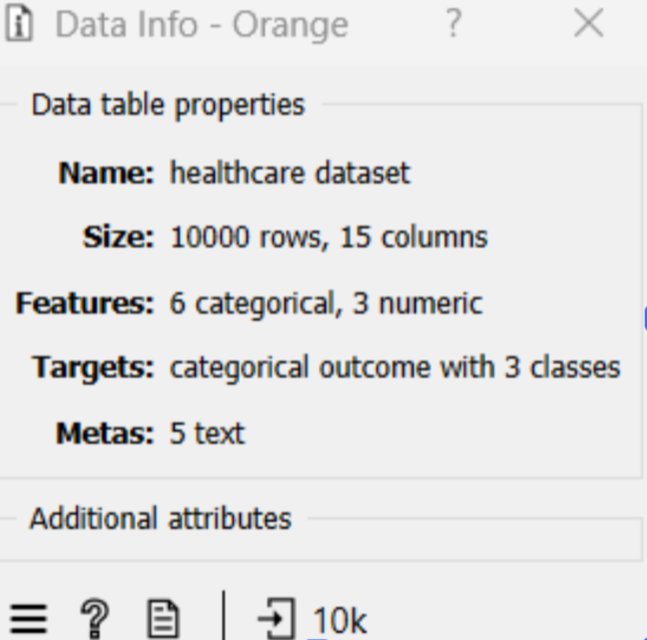
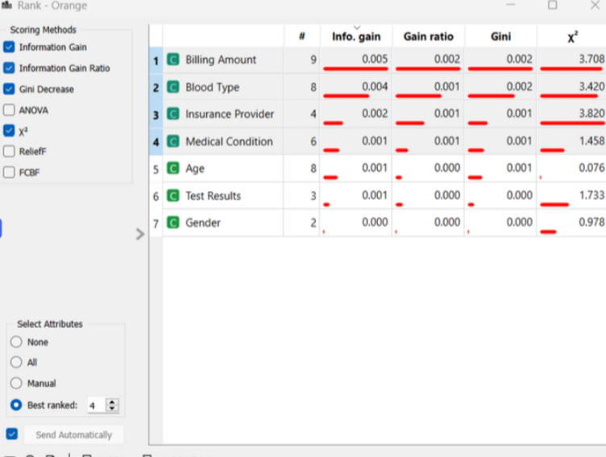
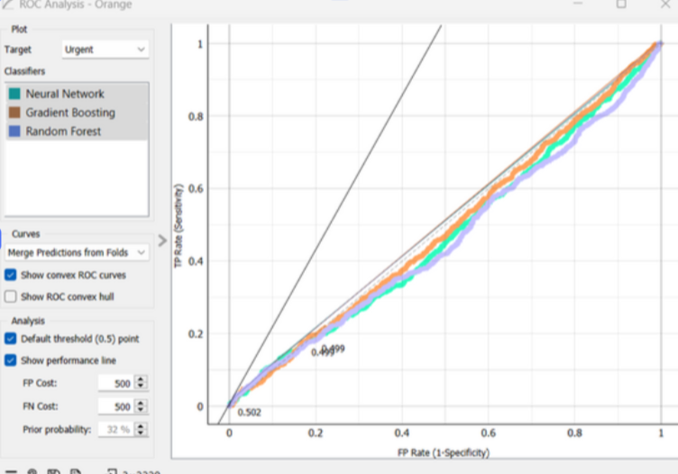

# Clinical Trial Patient Selection & Admission Type Prediction

A data mining pipeline that predicts hospital admission types - Elective, Urgent, or Emergency - to optimize patient recruitment for clinical trials. Built in Orange Data Mining on 10,000 synthetic patient records using Neural Networks and Gradient Boosting.

<p align="center">
  <strong><a href="https://tejashwinisaravanan.github.io/Clinical-Trial-Patient-Selection-Optimization/">View Live on GitHub Pages</a></strong> · <strong><a href="docs/AI_in_Healthcare_KM_Research_Paper.pdf">View Research Paper</a></strong>
</p>

---

<p align="center">
  
</p>

<p align="center"><em>The complete Orange pipeline - data ingestion, preprocessing, feature ranking, model training, and ROC evaluation.</em></p>

---

## Overview

Patient recruitment is one of the most expensive phases of any clinical trial - roughly 80% of trials miss enrollment timelines, often because unstable patients drop out mid-study. Predicting admission urgency from a patient's profile before enrollment allows trial coordinators to screen out high-risk candidates early, protecting patient safety and reducing dropout rates.

This project builds that screening pipeline. The target variable is admission type - Elective, Urgent, or Emergency - which serves as a proxy for patient stability. A patient predicted as Emergency is likely too unstable for most trial protocols. A patient predicted as Elective is a strong recruitment candidate.

The technical findings here connect directly to a broader research argument made in the accompanying paper: that AI-driven predictive analytics in healthcare only reaches its potential when models are integrated with rich, longitudinal patient data rather than static demographic snapshots.

---

## Research Foundation

This project is supported by an original academic research paper:

**[The Use of Artificial Intelligence in Healthcare Knowledge Management](docs/AI_in_Healthcare_KM_Research_Paper.pdf)**
Tejashwini Saravanan - Seattle Pacific University, Spring 2024

The paper examines how AI technologies including machine learning, NLP, and predictive analytics can improve clinical decision-making by shifting healthcare from reactive to proactive. The 33% accuracy finding in this project is a direct empirical demonstration of one of the paper's central arguments - that demographic data alone is insufficient for clinical prediction, and that integrating dynamic EHR data is essential for deployable models.

---

## The Data

| | |
|---|---|
| Records | 10,000 synthetic patient profiles |
| Target | Admission Type - Elective, Urgent, Emergency |
| Class Balance | Equal distribution across all three classes |
| Features | Age, Gender, Blood Type, Medical Condition, Insurance Provider, Billing Amount, Medication, Test Results |
| Tool | Orange Data Mining 3.x |

Synthetic records were used to allow open analysis without HIPAA constraints. In a production clinical trial setting, this pipeline would run on de-identified EHR data governed by a formal data use agreement.

<p align="center">
  
</p>

<p align="center"><em>10,000 records with balanced class distribution - intentional design to prevent models from achieving misleading accuracy by predicting only the majority class.</em></p>

---

## Pipeline Walkthrough

### Preprocessing and Data Governance

**Column selection.** Patient names, doctor IDs, and admission dates were removed at ingestion - non-predictive identifiers that would introduce data leakage or expose personally identifiable information. In a real clinical context this is a compliance requirement, not a modeling choice.

**Discretization.** Age and Billing Amount were binned into clinically meaningful categories rather than left as raw numbers. Age was grouped into Pediatric, Adult, and Geriatric ranges. A model that predicts risk for a Geriatric patient is more interpretable to a clinical trial coordinator than one predicting risk for "age 67."

**Domain purging.** Empty attribute values and redundant categories were removed after filtering using Orange's Purge Domain node - a step that is often skipped in classroom projects but is critical in production. Ghost categories left over from filtering can silently distort model training.

---

### Feature Importance

Before training any model, Orange's Rank node scored each feature using two independent metrics: Information Gain and Gini Decrease. Features ranking highly on both are genuine predictors - not artifacts of one scoring method.

<p align="center">
  
</p>

<p align="center"><em>Billing Amount and Blood Type ranked as the strongest predictors - a result that itself reveals important limitations about what demographic data can and cannot tell us about clinical urgency.</em></p>

---

### Model Training

Two algorithms were selected and compared:

**Neural Network** - chosen for its ability to capture non-linear interactions between clinical variables. Patient risk is rarely a linear function of any single feature.

**Gradient Boosting** - chosen as an ensemble method that builds sequentially on weak learners to minimize prediction error. Widely used in clinical prediction tasks because it handles mixed data types well and is robust to class imbalance.

Both models were evaluated using 10-fold cross-validation.

---

### ROC Analysis

<p align="center">
  
</p>

<p align="center"><em>ROC curves for both models across Elective, Urgent, and Emergency classes. AUC values near 0.50 - the random baseline - signal that the available features lack predictive power for this target variable.</em></p>

| Model | Accuracy | AUC |
|---|---|---|
| Neural Network | ~33% | ~0.50 |
| Gradient Boosting | ~33% | ~0.50 |

---

## The Core Finding - Why 33% Is the Most Important Result

Both models performed at approximately 33% - the same as a random guess in a balanced three-class problem. This is not a failure. It is the most clinically significant finding in the project.

When two strong algorithms independently converge at the random baseline, the conclusion is clear: the available features do not contain sufficient signal to predict the target variable. Demographic data - age, gender, blood type, insurance provider, billing amount - cannot predict admission urgency. This makes clinical sense. Emergency admissions are often triggered by acute events - a cardiac episode, a sudden infection, a fall - that leave no trace in a patient's demographic profile. You cannot predict a random event from stable background data.

The actionable output from this finding is a direct recommendation: a deployable patient screening model for clinical trials requires dynamic EHR data - vital signs, lab results, historical comorbidities, medication adherence - not static demographic snapshots. This conclusion is consistent with the literature reviewed in the accompanying research paper and points directly toward the cloud architecture outlined in the companion GCP project, which was designed to handle exactly this kind of real-time clinical data at scale.

---

## Supplementary Excel Analysis

A Model Performance Analysis Matrix was built in Excel alongside the Orange pipeline. It includes confusion matrix breakdowns across all three admission classes, side-by-side metric comparisons between both models, and a cost-benefit projection modeling the operational and financial impact of reducing false negatives - cases where a high-risk patient is incorrectly classified as stable, which is the highest-cost error type in a clinical trial screening context.

Available in the `docs/` folder.

---

## Repository Structure

```
Clinical-Trial-Patient-Selection-Optimization/
│
├── data/
│   └── Patient_Health_Records_Dataset.csv
│
├── workflow/
│   └── Admission_Prediction_Workflow.ows          # Orange workflow (fully reproducible)
│
├── docs/
│   ├── Project_Report_and_Analysis.pdf
│   ├── Model_Performance_Analysis_Matrix.xlsx
│   └── AI_in_Healthcare_KM_Research_Paper.pdf     # Supporting research paper
│
├── workflow_preview.png
├── feature_rankings.png
├── roc_curves.png
├── data_info.png
├── requirements.txt
└── README.md
```

---

## Limitations and Next Steps

The most important next step is replacing synthetic data with real de-identified EHR data. Synthetic records validate pipeline architecture but cannot capture the clinical complexity of real patient populations - comorbidity patterns, medication interactions, and regional demographic variation that affect admission urgency in practice.

Adding dynamic features - vital signs, lab trends, historical admission patterns - would give the model the signal the current dataset lacks. Based on the research paper literature, integrating these features would be expected to push AUC well above the 0.50 baseline.

The final step would be connecting this screening pipeline to a cloud deployment architecture - specifically the GCP stack in the companion project - to enable real-time patient scoring at the scale of an actual clinical trial network.

---

## Related Projects

This project is part of a healthcare analytics portfolio:

- **[Healthcare Analytics - PySpark ML & GCP Strategy](https://github.com/TejashwiniSaravanan/Healthcare-Analytics-PySpark-ML-GCP-Strategy)** - The cloud architecture designed to operationalize this screening pipeline at scale using BigQuery, Vertex AI, and Cloud Healthcare API
- **[AI in Healthcare Knowledge Management](docs/AI_in_Healthcare_KM_Research_Paper.pdf)** - The research paper providing the academic foundation for the predictive analytics approach used here

---

## Tools

Orange Data Mining 3.x · Microsoft Excel · Neural Networks · Gradient Boosting · ROC Analysis · Information Gain · Gini Decrease

---

## About Me

**Tejashwini Saravanan** - Master's student in Data Analytics at Seattle Pacific University, focused on healthcare data engineering, clinical analytics, and scalable ML pipelines.

[LinkedIn](https://www.linkedin.com/in/tejashwinisaravanan/) · [GitHub](https://github.com/TejashwiniSaravanan)

---

*Dataset: Synthetic Patient Health Records · Tool: Orange Data Mining · Seattle Pacific University*
